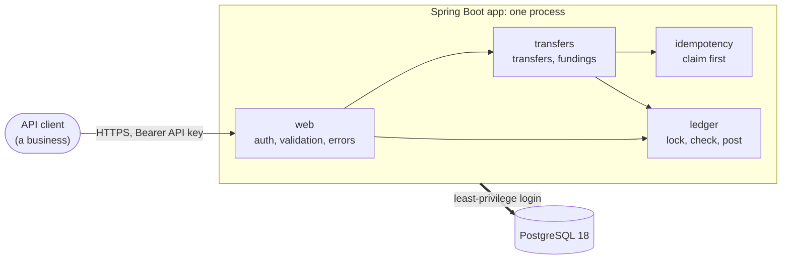

# double-entry-ledger

[](https://github.com/JhanModi/double-entry-ledger/actions/workflows/ci.yml)

A double-entry ledger and transfers API in Java 25, Spring Boot 4, and PostgreSQL 18. It's built to stay correct when requests are retried, race each other, or fail halfway.

Businesses use it through an API. Each one opens customer accounts, funds them, and moves money between its own accounts. Every movement is a balanced, append-only ledger posting, and every balance can be recomputed from those postings.

## What it demonstrates

- **Money is never created or destroyed.** Every posting balances, per currency. That's enforced in Java, and again by the database when the transaction commits. History is append-only: mistakes are corrected with new postings, never edits. ([`LedgerSchemaIT`](src/test/java/io/github/jhanmodi/ledger/ledger/LedgerSchemaIT.java), [`InvariantCheckerIT`](src/test/java/io/github/jhanmodi/ledger/ledger/InvariantCheckerIT.java))
- **It stays correct under concurrency.** Accounts are locked in one fixed order, and funds are re-checked under the lock. One test sends 1,000 concurrent transfers and fundings at four accounts while an invariant checker verifies the books throughout: about 4 seconds on a local machine, every check clean. ([`ConcurrencyIT`](src/test/java/io/github/jhanmodi/ledger/ConcurrencyIT.java))
- **Retries are safe.** The idempotency key is claimed first, in the same transaction as the money movement. A retry gets the original response, and money never moves twice, even when ten copies of a request arrive at once. ([`TransferServiceIT`](src/test/java/io/github/jhanmodi/ledger/transfers/TransferServiceIT.java), [`UniqueKeyBackstopIT`](src/test/java/io/github/jhanmodi/ledger/transfers/UniqueKeyBackstopIT.java))
- **Clients are isolated from each other.** Another client's account is a 404, identical to one that doesn't exist. The SQL enforces it, and composite foreign keys enforce it again in the schema. ([`AccountsApiIT`](src/test/java/io/github/jhanmodi/ledger/web/AccountsApiIT.java), [`MoneyMovementSchemaIT`](src/test/java/io/github/jhanmodi/ledger/transfers/MoneyMovementSchemaIT.java))
- **The app has least privilege.** Its database login can't update or delete history, disable triggers, or change the schema. Opening an account, moving money, and creating clients and keys are each audited in the same transaction. ([`AppRolePrivilegesIT`](src/test/java/io/github/jhanmodi/ledger/AppRolePrivilegesIT.java))
- **The tests are tested.** There are 152 unit tests and 242 integration tests. They include property-based tests, integration tests against real Postgres in Docker, concurrency tests, API tests, and architecture rules. Since M4a, every checkpoint has ended with bugs deliberately planted in a copy of the code, to confirm a test catches each one; in M5 and M6 alone, all 57 were caught. ([milestone log](docs/milestone-log.md))

## See it run

[**docs/demo-transcript.md**](docs/demo-transcript.md) is a captured run of [`scripts/demo.sh`](scripts/demo.sh), which walks through the API and checks every response. It shows:
- a funding and a transfer;
- a retried request replayed, a reused key refused, an overdraw refused, and a decimal amount refused;
- another client unable to see or move the money;
- the same transfer sent 10 times at once moving money exactly once;
- 30 transfers racing to empty an account that can cover only 26 of them;
- the books still balancing to the cent at the end.

## How it fits together



A modular monolith: one process and one database, with module boundaries enforced by ArchUnit. [**docs/architecture.md**](docs/architecture.md) has the full diagram, a transfer step by step, the data model, and how each rule is enforced in two layers.

## The API

| Endpoint | Scope | What it does |
|---|---|---|
| `POST /v1/accounts` | `write` | Open a customer account in one currency |
| `GET /v1/accounts/{id}` | `read` | Read an account and its balance |
| `GET /v1/accounts/{id}/entries` | `read` | Read its ledger entries, newest first, a page at a time |
| `POST /v1/transfers` | `write` | Move money between two of the client's accounts |
| `GET /v1/transfers/{id}` | `read` | Read a transfer |
| `POST /v1/fundings` | `admin` | Fund one of the client's accounts; stands in for a bank deposit |

The full contract is [**docs/openapi.yaml**](docs/openapi.yaml) (OpenAPI 3.1). It's written by hand, a test fails the build if it disagrees with the code, and CI lints it ([ADR-0024](docs/adr/0024-hand-written-openapi-spec-checked-against-the-code.md)).

**Conventions:**
- **Amounts** are integer minor units plus a currency: `{"amount": 1050, "currency": "USD"}` is $10.50. Anything else, such as `10.5` or `"1050"`, is rejected, and so are fields the API doesn't define.
- **Every money-moving POST needs an `Idempotency-Key` header.** Retrying with the same key and body returns the original response (with `Idempotent-Replayed: true`) for at least 24 hours, and never moves money twice. The same key with a different body is a 422. A 409 `request-in-progress` means the first attempt hasn't finished: retry after `Retry-After` with the same key and body.
- **Errors** use RFC 9457 Problem Details, with one `type` per kind of error ([catalogue](docs/design.md#errors)) and a `requestId` that matches the `X-Request-Id` header.
- **A 503 `account-busy` means "try again later":** other requests held the account for too long. Nothing moved, so retry after the `Retry-After` delay with the same `Idempotency-Key`.

## Run it locally

You need JDK 25 and Docker (Docker Desktop on Windows and macOS). Maven doesn't need to be installed: the Maven Wrapper (`mvnw`) downloads the pinned version. In PowerShell, use `.\mvnw` instead of `./mvnw`.

1. Create your local config, then replace the placeholder passwords in `.env`:
   ```bash
   cp .env.example .env
   ```
   If port 5432 is already in use (for example by a PostgreSQL installed directly on your machine), set `DB_PORT=5433` in `.env`. Docker Compose and the app both read it.
2. Start Postgres. On its first start, it creates the restricted login the app connects as, from `.env`. If you set up your database before these roles existed, reset it once with `docker compose down -v`, which **deletes all local data**.
   ```bash
   docker compose up -d
   ```
3. Build the app, then start it. Flyway applies the database migrations on startup.
   ```bash
   ./mvnw -q package -DskipTests
   ```
   ```bash
   java -jar target/double-entry-ledger-0.0.1-SNAPSHOT.jar
   ```
4. In another terminal, run the demo. It needs `jq`, creates its own API clients, and checks every response:
   ```bash
   bash scripts/demo.sh
   ```

To call the API yourself, create a client and its first API key. The key is printed **once**, so store it safely; the `admin` scope is only needed to fund accounts.
```bash
java -jar target/double-entry-ledger-0.0.1-SNAPSHOT.jar clients create --name=acme --scopes=read,write,admin
```
```bash
curl -X POST http://localhost:8080/v1/accounts -H "Authorization: Bearer $API_KEY" -H "Content-Type: application/json" -d '{"currency":"USD"}'
```

## Tests

```bash
./mvnw verify
```

This compiles, runs the unit tests (`*Test`) and the integration tests (`*IT`, which start Postgres in Docker through Testcontainers), and checks formatting. CI runs the same command, plus a gitleaks scan of the full history and a lint of the API spec.

- `./mvnw test` runs only the unit tests. It's fast and doesn't need Docker.
- `./mvnw spotless:apply` fixes formatting ([Palantir Java Format](https://github.com/palantir/palantir-java-format)).

## Docs

- [Architecture](docs/architecture.md): a ten-minute tour, with diagrams
- [Design](docs/design.md): architecture, flows, invariants, and failure modes, each failure mode tied to a test
- [Architecture decision records](docs/adr/README.md): 25 decisions, each with the options considered and the reasoning
- [API contract](docs/openapi.yaml), [glossary](docs/glossary.md), and [security policy](SECURITY.md)
- [Roadmap](docs/roadmap.md) and [milestone log](docs/milestone-log.md)

## Status

Built so far: the ledger core, least-privilege database roles, API-key authentication with tenant isolation, transfers and fundings with an audit log, concurrency control, and idempotent retries. Next: reversals, then payments through a simulated bank, a transactional outbox, reconciliation, and multi-currency FX.

**Not production-ready, on purpose:** there's no rate limiting yet (M15b), so the app must not be deployed publicly, and local development runs without TLS. Known gaps are listed in the [roadmap](docs/roadmap.md#known-gaps).

## License

[MIT](LICENSE)
