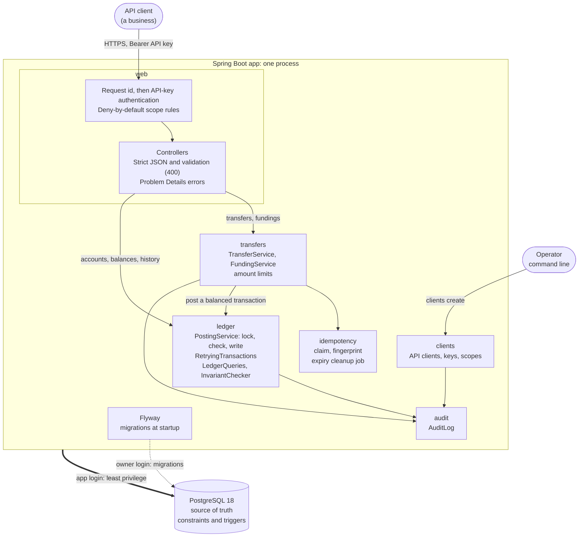
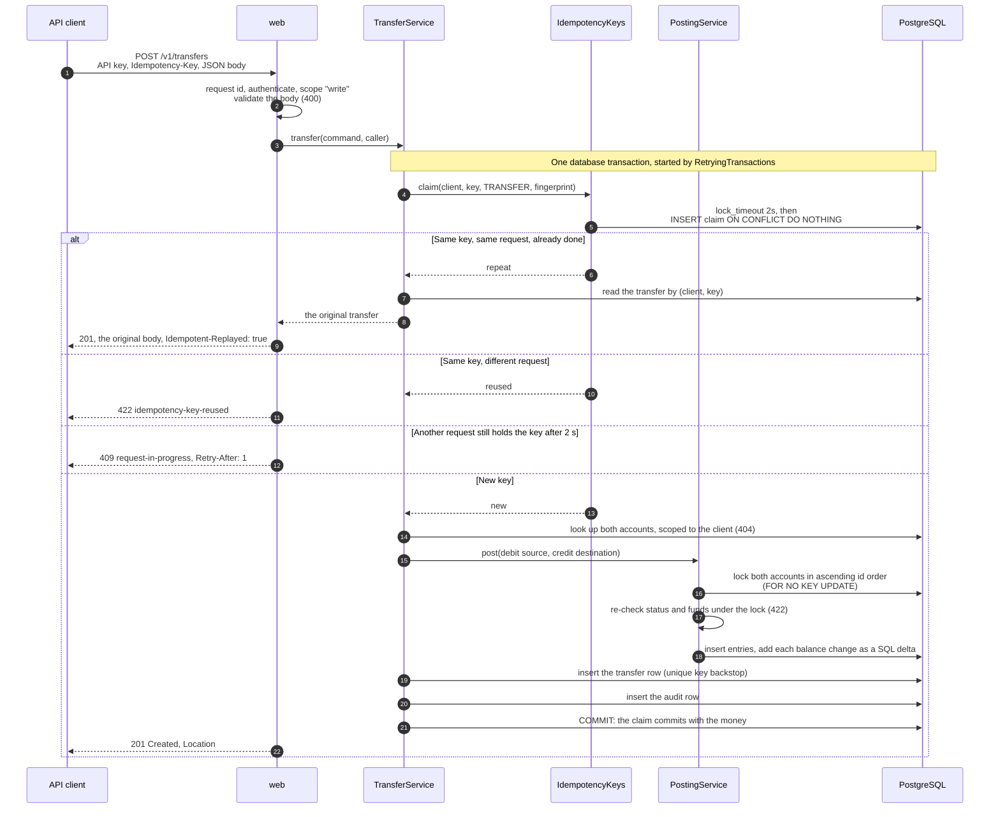
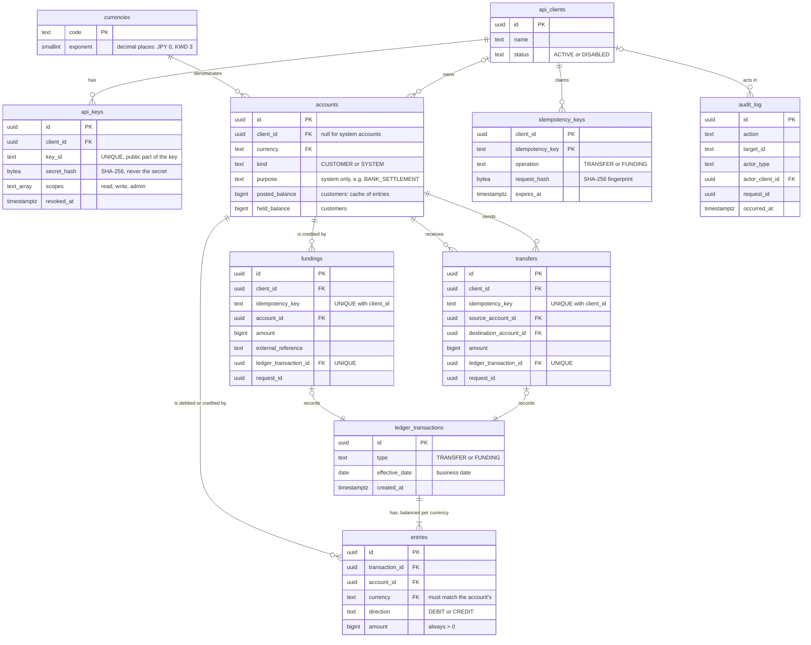

# Architecture

A ten-minute tour of what exists today. The [README](../README.md) is the two-minute version; [design.md](design.md) and the [ADRs](adr/README.md) are the full reference, including what's planned.

## What it is

A double-entry ledger and transfers API for businesses: Java 25 and Spring Boot 4, on PostgreSQL 18. A client opens customer accounts, funds them, and moves money between its own accounts. Every movement is recorded as a balanced, append-only posting: debits equal credits, and nothing is ever updated or deleted. Every balance can be recomputed from those postings, and an invariant checker proves it matches.

It's a **modular monolith**: one process and one database, with module boundaries enforced by tests ([ADR-0001](adr/0001-modular-monolith.md)). Correctness under retries and concurrency matters more here than scale, and one database transaction is the simplest way to get it. Each distributed piece adds new ways to fail, so none is added before it's needed.

## The pieces

- **Every request** gets a server-generated request id first, so even a rejected one can be traced ([ADR-0021](adr/0021-request-ids-and-strict-request-parsing.md)). Then its API key is checked, and the endpoint's scope rule applies. An endpoint without a rule is unreachable, even with a valid key ([ADR-0017](adr/0017-tenant-isolation-and-error-format.md)).
- **Modules depend in one direction only:** web → transfers → idempotency → ledger → clients → audit, with `money` used by all of them. `ArchitectureTest` (ArchUnit) fails the build if a dependency points the other way.
- **Only the ledger module writes ledger entries and balances,** and every write goes through `PostingService`. Transfers and fundings are business records that sit beside the ledger and point to their ledger transaction ([ADR-0018](adr/0018-transfers-and-funding-over-the-ledger.md)).
- **Two database logins** ([ADR-0015](adr/0015-least-privilege-database-roles.md)). The app connects as a restricted login that can't update or delete history, disable triggers, or change the schema. Flyway connects as the owner, for migrations only.
- **The API contract** is [openapi.yaml](openapi.yaml). It's written by hand, and `OpenApiSpecIT` fails the build if it disagrees with the code ([ADR-0024](adr/0024-hand-written-openapi-spec-checked-against-the-code.md)).

## A transfer, step by step

The path that matters most: what happens to `POST /v1/transfers`, including a retry.

- **The claim comes first,** before any lookup or posting ([ADR-0023](adr/0023-idempotency-with-claim-first-and-replay.md)). A retry is recognized even after the money has been spent, and a simultaneous duplicate waits at the claim before it touches an account.
- **Any failure rolls everything back,** the claim included: a 404, a 422, a 503, or a crash. The key stays free, so a retry runs again. Only successes are remembered.
- **Lock, then check:** status and balances are trusted only once re-read under the lock. Locking in one fixed order means two opposite transfers can't deadlock ([ADR-0005](adr/0005-pessimistic-row-locking.md)).
- **Waiting is bounded** ([ADR-0022](adr/0022-lock-timeouts-retries-and-the-busy-response.md)). If another request holds an account for over 2 seconds, the answer is 503 `account-busy` with `Retry-After`, and nothing has moved. If Postgres aborts the transaction to break a deadlock, `RetryingTransactions` runs it again from the claim, up to 3 attempts.
- **Not shown:** if a transfer with this key already exists but its claim has expired (after at least 24 hours), the answer is 409 `duplicate-request`, before any money moves.

## The data model

The tables and the rules the database itself enforces. Customer accounts belong to a client; system accounts, such as each currency's bank-settlement account, belong to none.

What the database enforces, whatever the Java code does:
- **Every ledger transaction balances per currency and has at least 2 entries,** checked by a trigger when the database transaction commits.
- **Entries, ledger transactions, transfers, fundings, and the audit log are append-only.** Triggers reject an update or delete by any role, and the app's login isn't granted either. Mistakes are corrected with new postings, never edits.
- **A customer's available balance can't go negative** (`CHECK`). This backstops the check made under the lock.
- **A transfer or funding can only name accounts of its own client, in its own currency,** through composite foreign keys such as `(source_account_id, client_id, currency) → accounts (id, client_id, currency)`.
- **One idempotency key moves money at most once:** `UNIQUE (client_id, idempotency_key)` on transfers and fundings, kept even after the claim expires.
- **All ids are UUIDv7,** generated by Postgres ([ADR-0014](adr/0014-uuidv7-ids.md)), and every amount is a `BIGINT` of minor units, never a float ([ADR-0002](adr/0002-money-as-integer-minor-units.md)).

## How it stays correct

Each important rule is enforced in two layers, so one mistake isn't enough to break it, and each layer is tested on its own.

| Rule | In Java | In the database | Tests |
|---|---|---|---|
| Every posting balances | `PostingRequest` refuses an unbalanced posting | Trigger at commit | `PostingRequestTest`, `LedgerSchemaIT` |
| No overdraft, even under concurrency | Funds re-checked under the row lock (`BalanceChanges`) | `CHECK` on the available balance | `BalanceChangesTest`, `LedgerSchemaIT`, `ConcurrencyIT` |
| A client only touches its own accounts | `LedgerQueries.accountOwnedBy` puts the client in the SQL | Composite foreign keys | `AccountsApiIT`, `TransfersApiIT`, `MoneyMovementSchemaIT` |
| A retry never moves money twice | The claim, first in the transaction | `UNIQUE (client_id, idempotency_key)` | `IdempotencyKeysIT`, `TransferServiceIT`, `UniqueKeyBackstopIT` (claim layer switched off) |
| History never changes | No code path updates or deletes it | Append-only triggers, and no grant to the app | `LedgerSchemaIT`, `AppRolePrivilegesIT` |
| Balances match the entries | Every balance change is a SQL delta in the posting's transaction | (verified, not enforced) | `InvariantCheckerIT`, run throughout `ConcurrencyIT` |

**Under load:** `ConcurrencyIT` sends 1,000 mixed transfers and fundings, including overdraws and repeated keys, at four accounts at once. The invariant checker runs throughout and after. Every balance must equal what the successful requests add up to, and every repeat must replay exactly its original's result. A second test posts in every account order straight through `PostingService`, without the retry layer, so a broken lock order would surface as a deadlock rather than be hidden by a retry.

**Do the tests catch bugs?** At each milestone's end, bugs were deliberately planted in a copy of the code, such as dropping the lock, skipping the ownership check, or breaking the claim, to confirm a test fails. The [milestone log](milestone-log.md) records each run.

## What's not built yet

- **Payments to and from a (simulated) bank,** with holds, a state machine, and recovery from timeouts: M9a and M9b.
- **Reversals** (M8), the **transactional outbox** and events (M10 and M13), **reconciliation** (M11), and **multi-currency FX** (M12).
- **Rate limiting** (M15b). Until then, the authentication and money-moving endpoints are knowingly not rate-limited, so the app must not be deployed publicly.
- **Metrics and dashboards** (M14), **load testing with k6** (M15), and a **deployment** (M16).

The [roadmap](roadmap.md) has the order and the open decisions.
